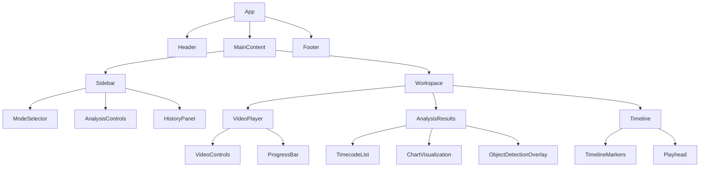
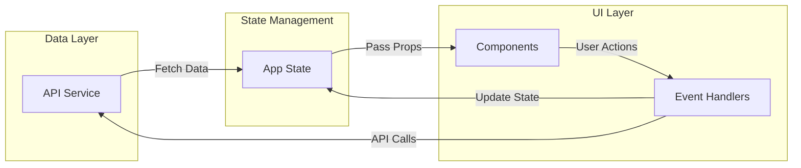

# Component Architecture

## Frontend Component Hierarchy

## Component Descriptions

### Core Layout Components

1. **App**
   - Root component that manages global state and routing
   - Handles API communication and data fetching
   - Manages theme and user preferences

2. **Header**
   - Application title and navigation
   - User profile and settings
   - Upload controls

3. **MainContent**
   - Main layout container
   - Manages responsive behavior

4. **Footer**
   - Copyright information
   - Links to documentation and support

### Sidebar Components

1. **ModeSelector**
   - Dropdown for selecting analysis mode
   - Mode descriptions and previews

2. **AnalysisControls**
   - Start/stop analysis buttons
   - Analysis progress indicators
   - Custom prompt input

3. **HistoryPanel**
   - List of previous analyses
   - Search and filter functionality
   - Favorite/star important analyses

### Workspace Components

1. **VideoPlayer**
   - Video playback controls
   - Custom video controls overlay
   - Fullscreen support

2. **AnalysisResults**
   - Displays analysis output based on mode
   - Tabbed interface for different result types
   - Export functionality

3. **Timeline**
   - Visual representation of video timeline
   - Shows key moments and markers
   - Interactive scrubbing

### Video Player Components

1. **VideoControls**
   - Play/pause, volume, speed controls
   - Time display
   - Fullscreen toggle

2. **ProgressBar**
   - Video progress indicator
   - Click to seek
   - Shows buffered ranges

### Analysis Components

1. **TimecodeList**
   - Scrollable list of timecodes
   - Click to navigate video
   - Search and filter functionality

2. **ChartVisualization**
   - Interactive charts for analysis data
   - Time-series visualization
   - Zoom and pan controls

3. **ObjectDetectionOverlay**
   - Displays detected objects over video
   - Toggle visibility of object types
   - Click for details

### Timeline Components

1. **TimelineMarkers**
   - Visual markers for key moments
   - Color-coded by category
   - Hover for preview

2. **Playhead**
   - Current playback position indicator
   - Draggable for seeking
   - Shows current timecode

## Data Flow

## State Management

The application uses a combination of React Context and local component state:

1. **Global State (Context)**
   - Current video reference
   - Analysis results
   - User preferences
   - Authentication state

2. **Local Component State**
   - UI-specific state (e.g., dropdown open/closed)
   - Form inputs
   - Component-specific data

## Performance Considerations

1. **Code Splitting**
   - Lazy loading of heavy components
   - Route-based code splitting

2. **Memoization**
   - React.memo for expensive components
   - useMemo for derived state
   - useCallback for stable function references

3. **Virtualization**
   - Virtualized lists for long scrollable content
   - Windowing for large datasets

4. **Asset Optimization**
   - Lazy loading of images and videos
   - Responsive image sizing
   - Video quality adaptation
