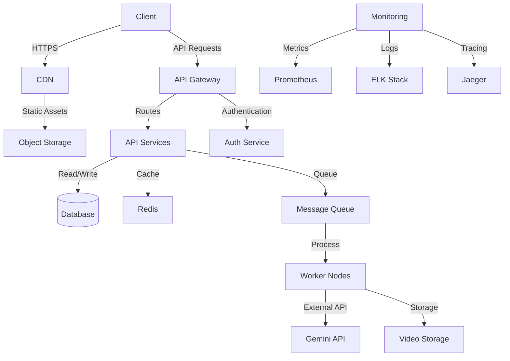
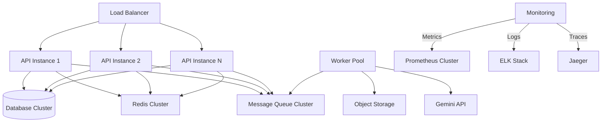
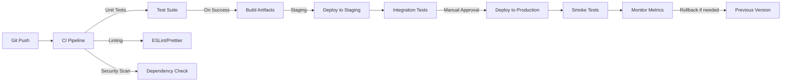

# Deployment Architecture

## System Overview

## Infrastructure Components

### 1. Frontend
- **CDN**: Global content delivery network for static assets
- **Object Storage**: S3-compatible storage for static files
- **Web Server**: Serves the React application (Nginx, CloudFront)

### 2. Backend Services
- **API Gateway**: Routes requests to appropriate services
- **Auth Service**: Handles user authentication and authorization
- **API Services**: Microservices for different functionalities
  - Video Processing Service
  - Analysis Service
  - User Service
  - Notification Service

### 3. Data Layer
- **Primary Database**: PostgreSQL for structured data
- **Cache**: Redis for session management and caching
- **Message Queue**: RabbitMQ/Kafka for async processing
- **Object Storage**: For video file storage (S3, GCS, or similar)

### 4. Worker Infrastructure
- **Worker Nodes**: Process video analysis jobs
- **Container Orchestration**: Kubernetes/Docker Swarm for managing workers
- **Auto-scaling**: Scales based on queue length

### 5. Monitoring & Observability
- **Metrics**: Prometheus for system metrics
- **Logs**: ELK Stack (Elasticsearch, Logstash, Kibana)
- **Tracing**: Jaeger for distributed tracing
- **Alerting**: AlertManager with custom rules

## Production Deployment

### High Availability Setup

### Auto-scaling Configuration

1. **API Layer**
   - Scale based on CPU/Memory usage
   - Target: 60-70% CPU utilization
   - Cooldown: 300 seconds

2. **Worker Layer**
   - Scale based on queue length
   - Scale up when queue > 50
   - Scale down when queue < 10
   - Max instances: 20

3. **Database**
   - Read replicas for scaling reads
   - Connection pooling
   - Query optimization

## CI/CD Pipeline

## Security Considerations

1. **Network Security**
   - VPC with private subnets
   - Security groups and network ACLs
   - WAF (Web Application Firewall)

2. **Data Protection**
   - Encryption at rest and in transit
   - Key management with KMS
   - Regular backups with point-in-time recovery

3. **Access Control**
   - IAM roles and policies
   - Principle of least privilege
   - Multi-factor authentication

4. **Compliance**
   - GDPR/CCPA compliance
   - Regular security audits
   - Penetration testing

## Cost Optimization

1. **Compute**
   - Spot instances for worker nodes
   - Right-sizing instances
   - Auto-scaling based on demand

2. **Storage**
   - Lifecycle policies for old videos
   - Intelligent tiering for storage classes
   - Data compression where applicable

3. **Networking**
   - CDN for static assets
   - Data transfer optimization
   - Caching strategies

## Disaster Recovery

1. **Backup Strategy**
   - Daily database backups
   - Point-in-time recovery
   - Regular backup testing

2. **Multi-region Deployment**
   - Active-passive setup
   - DNS failover
   - Data replication across regions

3. **Incident Response**
   - Runbooks for common failures
   - Automated alerting
   - Post-mortem process
