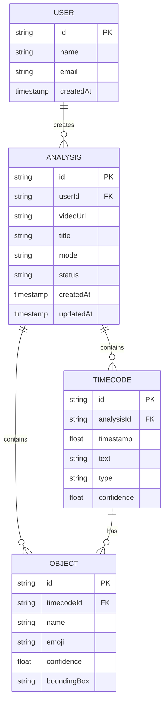

# Entity Relationship Diagram

## Entity Descriptions

### User
Represents an application user who can create and manage video analyses.

**Fields:**
- `id`: Unique identifier
- `name`: User's display name
- `email`: User's email address
- `createdAt`: Timestamp of account creation

### Analysis
Represents a single video analysis session.

**Fields:**
- `id`: Unique identifier
- `userId`: Reference to the user who created the analysis
- `videoUrl`: URL or reference to the video file
- `title`: User-provided title for the analysis
- `mode`: Analysis mode used (e.g., "A/V captions", "Key moments")
- `status`: Current status (processing, completed, failed)
- `createdAt`: Timestamp of creation
- `updatedAt`: Timestamp of last update

### Timecode
Represents a specific point or range in the video with associated text.

**Fields:**
- `id`: Unique identifier
- `analysisId`: Reference to the parent analysis
- `timestamp`: Time in seconds from the start of the video
- `text`: Description or caption text
- `type`: Type of timecode (e.g., "caption", "key moment")
- `confidence`: Confidence score from the AI analysis

### Object
Represents objects detected in the video at specific timecodes.

**Fields:**
- `id`: Unique identifier
- `timecodeId`: Reference to the parent timecode
- `name`: Name/type of the object
- `emoji`: Representative emoji for the object
- `confidence`: Detection confidence score
- `boundingBox`: Coordinates of the object's bounding box (if available)
