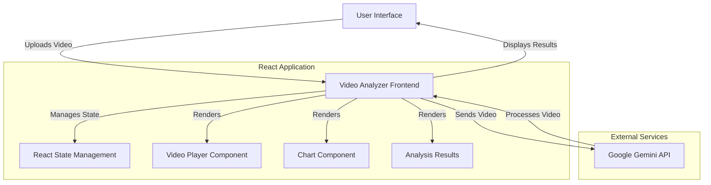

# Video Analyzer - Architecture Overview

## System Architecture

## Key Components

1. **Frontend Application (React)**
   - Video upload and playback interface
   - Analysis mode selection
   - Results visualization
   - User interaction handling

2. **API Layer**
   - Handles communication with Google's Gemini API
   - Manages file uploads and processing
   - Processes analysis requests

3. **External Services**
   - Google Gemini API: Provides AI-powered video analysis

## Data Flow

1. User uploads a video file through the web interface
2. The application sends the video to Google Gemini API for processing
3. Gemini API analyzes the video based on the selected mode (captions, key moments, etc.)
4. Analysis results are returned to the frontend
5. The frontend displays the results alongside the video player
6. Users can interact with the results to navigate the video

## Technologies Used

- **Frontend**: React, TypeScript, D3.js
- **Styling**: CSS Modules
- **Build Tool**: Vite
- **AI Integration**: Google Gemini API
- **State Management**: React Hooks

## Future Integration Points

1. **User Authentication**
   - Add user accounts and authentication
   - Save analysis history
   - Enable sharing of analysis results

2. **Additional Analysis Modes**
   - Sentiment analysis
   - Object detection
   - Speech-to-text transcription
   - Multi-language support

3. **Backend Services**
   - Implement a dedicated backend for:
     - User management
     - Video storage
     - Caching analysis results
     - Batch processing

4. **Collaboration Features**
   - Real-time collaboration on video analysis
   - Comments and annotations
   - Version control for analysis
