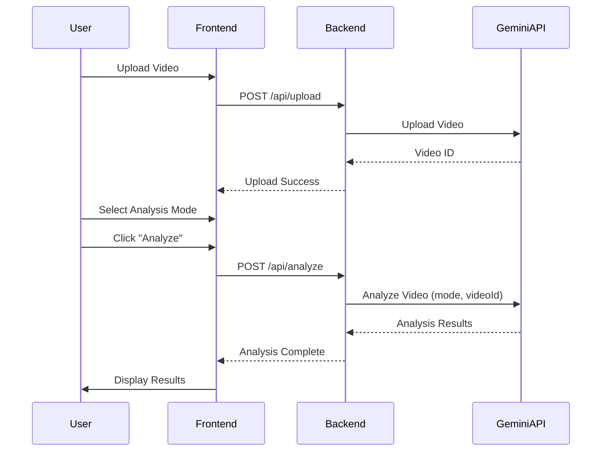
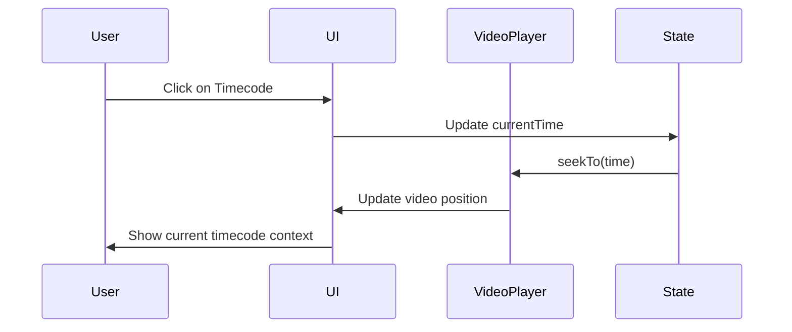
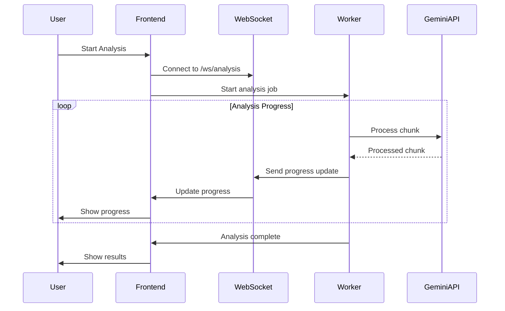
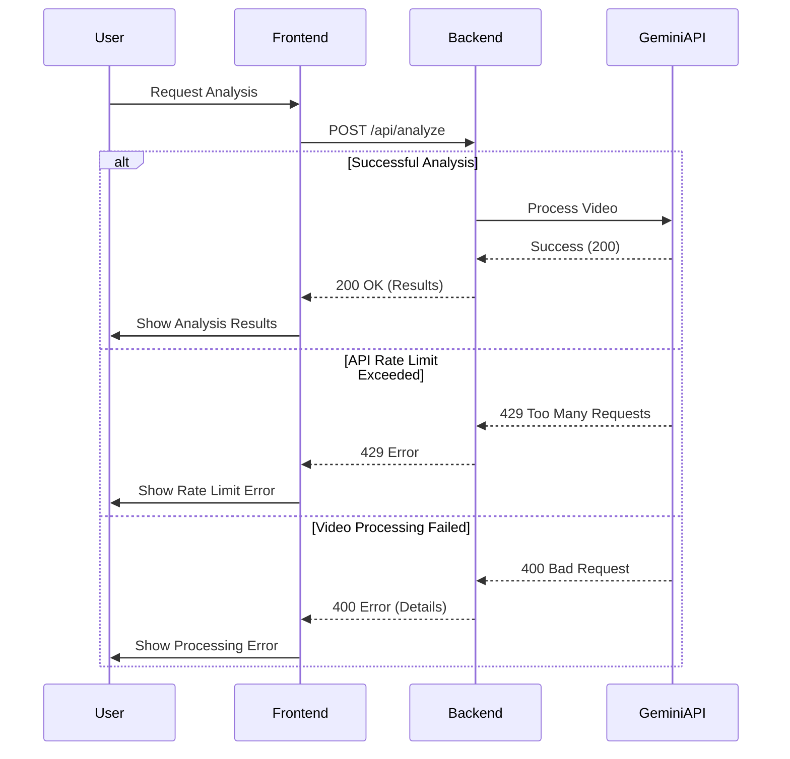
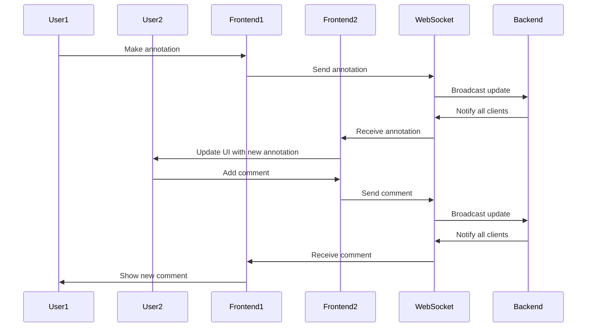

# Sequence Diagrams

## 1. Video Upload and Analysis

```mermaid
sequenceDiagram
    participant User
    participant Frontend
    participant Backend
    participant GeminiAPI
    
    User->>Frontend: Upload Video
    Frontend->>Backend: POST /api/upload
    Backend->>GeminiAPI: Upload Video
    GeminiAPI-->>Backend: Video ID
    Backend-->>Frontend: Upload Success
    
    User->>Frontend: Select Analysis Mode
    User->>Frontend: Click "Analyze"
    
    Frontend->>Backend: POST /api/analyze
    Backend->>GeminiAPI: Analyze Video (mode, videoId)
    GeminiAPI-->>Backend: Analysis Results
    Backend-->>Frontend: Analysis Complete
    
    Frontend->>User: Display Results
```

## 2. Video Playback with Timecodes

```mermaid
sequenceDiagram
    participant User
    participant UI
    participant VideoPlayer
    participant State
    
    User->>UI: Click on Timecode
    UI->>State: Update currentTime
    State->>VideoPlayer: seekTo(time)
    VideoPlayer->>UI: Update video position
    UI->>User: Show current timecode context
```

## 3. Real-time Analysis Processing

```mermaid
sequenceDiagram
    participant User
    participant Frontend
    participant WebSocket
    participant Worker
    participant GeminiAPI
    
    User->>Frontend: Start Analysis
    Frontend->>WebSocket: Connect to /ws/analysis
    Frontend->>Worker: Start analysis job
    
    loop Analysis Progress
        Worker->>GeminiAPI: Process chunk
        GeminiAPI-->>Worker: Processed chunk
        Worker->>WebSocket: Send progress update
        WebSocket->>Frontend: Update progress
        Frontend->>User: Show progress
    end
    
    Worker->>Frontend: Analysis complete
    Frontend->>User: Show results
```

## 4. Error Handling Flow

```mermaid
sequenceDiagram
    participant User
    participant Frontend
    participant Backend
    participant GeminiAPI
    
    User->>Frontend: Request Analysis
    Frontend->>Backend: POST /api/analyze
    
    alt Successful Analysis
        Backend->>GeminiAPI: Process Video
        GeminiAPI-->>Backend: Success (200)
        Backend-->>Frontend: 200 OK (Results)
        Frontend->>User: Show Analysis Results
    else API Rate Limit Exceeded
        GeminiAPI-->>Backend: 429 Too Many Requests
        Backend-->>Frontend: 429 Error
        Frontend->>User: Show Rate Limit Error
    else Video Processing Failed
        GeminiAPI-->>Backend: 400 Bad Request
        Backend-->>Frontend: 400 Error (Details)
        Frontend->>User: Show Processing Error
    end
```

## 5. Multi-user Collaboration

```mermaid
sequenceDiagram
    participant User1
    participant User2
    participant Frontend1
    participant Frontend2
    participant WebSocket
    participant Backend
    
    User1->>Frontend1: Make annotation
    Frontend1->>WebSocket: Send annotation
    WebSocket->>Backend: Broadcast update
    Backend->>WebSocket: Notify all clients
    WebSocket->>Frontend2: Receive annotation
    Frontend2->>User2: Update UI with new annotation
    
    User2->>Frontend2: Add comment
    Frontend2->>WebSocket: Send comment
    WebSocket->>Backend: Broadcast update
    Backend->>WebSocket: Notify all clients
    WebSocket->>Frontend1: Receive comment
    Frontend1->>User1: Show new comment
```
